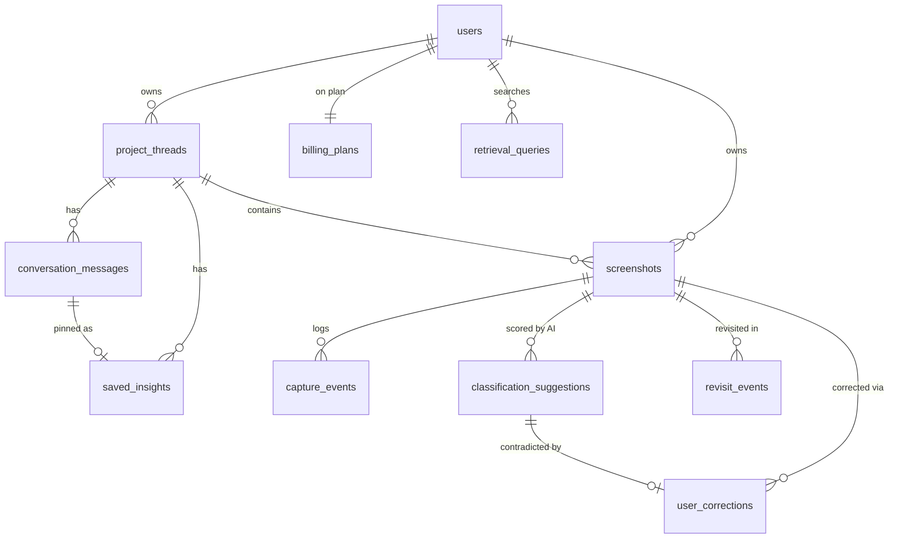

# 10 — Data Model

> Capso (working name — unconfirmed) Postgres schema on Supabase. Postgres 15+, extensions: `pgvector`, `pg_cron`, `pgcrypto` (uuid).
> Siblings: `09_AI_SYSTEM_AND_MODEL_ROUTING.md` (what writes these rows), `11_ARCHITECTURE.md` (call topology), `14_BACKEND_AND_STORAGE.md` (jobs table + buckets — the `jobs` table is specced there).

## Assumptions

- Single-user MVP (owner: Elvin) but every table carries `user_id` and RLS from day one — SaaS-ready is a locked requirement.
- Embedding dimension fixed at **1536** (see open provider decision in `09_AI_SYSTEM_AND_MODEL_ROUTING.md` §8).
- `auth.users` is Supabase-managed; our `users` table is a 1:1 profile extension.

## Out of scope

- `ocr_blocks` table with bounding boxes — **post-MVP** (decision below).
- Link/PDF-specific columns beyond the `capture_kind` enum.
- Billing enforcement columns beyond what `billing_plans` + `users.plan_id` provide.

## Decision: OCR storage = columns on `screenshots` (requirement)

MVP stores `ocr_text` (+ `summary`, tsvector) directly on `screenshots`. Justification: 1:1 relationship, one write per capture, search queries join nothing; a separate table buys flexibility we don't need until bounding boxes arrive. **Post-MVP**: add `ocr_blocks` (screenshot_id, text, bbox jsonb, block_index) for region-level highlight/search; `screenshots.ocr_text` remains as the denormalized concatenation.

## Enums

```sql
CREATE TYPE capture_kind AS ENUM ('screenshot', 'link', 'file');          -- only 'screenshot' produced in v1
CREATE TYPE processing_status AS ENUM ('pending', 'processing', 'processed', 'unprocessed'); -- unprocessed = failed after retries
CREATE TYPE capture_intent AS ENUM ('design_inspiration','ux_bug','competitor','marketing_hook','content_idea','reference','other');
CREATE TYPE suggestion_outcome AS ENUM ('auto_assigned','confirmed','ignored','overridden','pending');
CREATE TYPE message_role AS ENUM ('user','assistant','system','tool');
```

## Tables

### users
| Column | Type | Notes |
|--------|------|-------|
| id | uuid PK | = `auth.users.id` (FK, ON DELETE CASCADE) |
| email | text NOT NULL | mirrored from auth |
| plan_id | text FK → billing_plans.id | default `'free'`; unused for enforcement in MVP |
| usage_chat_turns_month | int DEFAULT 0 | reset by pg_cron monthly; gate counter (09 §5) |
| usage_captures_month | int DEFAULT 0 | analytics only |
| storage_bytes_used | bigint DEFAULT 0 | quota accounting (14) |
| settings | jsonb DEFAULT '{}' | hotkeys, thresholds overrides |
| created_at / updated_at | timestamptz | |

### project_threads
| Column | Type | Notes |
|--------|------|-------|
| id | uuid PK default gen_random_uuid() | |
| user_id | uuid NOT NULL FK → users ON DELETE CASCADE | |
| name | text NOT NULL | |
| description | text | fed into W1 candidate list |
| rolling_summary | text | chat memory; resummarized every N msgs (14 §5) |
| rolling_summary_msg_count | int DEFAULT 0 | msgs since last resummarize |
| is_inbox | boolean DEFAULT false | exactly one per user (partial unique index) |
| archived_at | timestamptz NULL | soft archive, not delete |
| archived | boolean NOT NULL DEFAULT false | screenshots only — set from the Tidy tab (24_FEATURE_SPEC_MEMORY.md). Archived rows leave the library, search scope and thread centroids but keep their data. Added 2026-07-31. |
| created_at / updated_at | timestamptz | |

Indexes: `(user_id)`, partial unique `(user_id) WHERE is_inbox`.

### screenshots
| Column | Type | Notes |
|--------|------|-------|
| id | uuid PK | |
| user_id | uuid NOT NULL FK → users CASCADE | |
| project_thread_id | uuid NULL FK → project_threads ON DELETE SET NULL | NULL ⇒ shows in Inbox |
| capture_kind | capture_kind NOT NULL DEFAULT 'screenshot' | future-proofing (locked decision) |
| storage_path | text NOT NULL | `user_id/screenshot_id.png` in `originals` bucket (14) |
| thumb_path | text | `user_id/screenshot_id.webp` in `thumbs` bucket |
| width / height | int | px |
| bytes | bigint | for storage accounting |
| source_app | text | frontmost app at capture (best-effort from Tauri) |
| processing_status | processing_status DEFAULT 'pending' | drives "unprocessed" badge |
| ocr_text | text | W1 output; untrusted content (09 §9) |
| summary | text | W1 output |
| type | text | W1 output (loose string by design) |
| intent | capture_intent | W1 output |
| why_saved | text | W1 output |
| search_tsv | tsvector GENERATED ALWAYS AS (to_tsvector('english', coalesce(ocr_text,'') \|\| ' ' \|\| coalesce(summary,''))) STORED | |
| embedding | vector(1536) NULL | W2 output |
| captured_at | timestamptz NOT NULL | client capture time |
| created_at / deleted_at? | timestamptz | **no soft delete** — delete is hard (below) |
| page_url / page_title | text | Browser captures only. The extension always sent these; nothing read them until loop 12 |
| tags | text[] NOT NULL DEFAULT '{}' | W1 output — model-proposed entity tags |
| user_tags | text[] NOT NULL DEFAULT '{}' | Owner-typed. **Never merged with `tags`** — removing a model tag is a correction, removing your own is an edit |
| ocr_source | ocr_source enum | `llm \| tesseract \| apple_vision` (06 §2) |
| ocr_langs | text[] | Detected languages; picks the analyzer |
| content_hash | text | Exact-duplicate detection at ingest |
| search_text | text NOT NULL DEFAULT '' | Pre-segmented searchable text — see the tsvector note below |

Indexes: `(user_id, captured_at DESC)`; `(project_thread_id, captured_at DESC)`; GIN on `search_tsv`; GIN on `tags` and `user_tags`; **HNSW** on `embedding` (`vector_cosine_ops`) — HNSW over ivfflat: no training step, fine at MVP row counts, better recall; `(user_id, processing_status)` partial WHERE status <> 'processed' (worker + badge queries); `(user_id, content_hash)` partial WHERE not null.

**Amendment (loop 12) — `search_tsv` config.** The row above specifies `to_tsvector('english', ocr_text || summary)`. That is wrong for this corpus: the `english` config treats a run of Han characters as one token, so `定價` never matches a document containing `定價頁面`, and hosted Supabase does not offer `zhparser`. Shipped instead: the client segments text with `Intl.Segmenter` (`apps/web/lib/retrieve.ts`) and writes the space-joined result to `search_text`; the generated column is `to_tsvector('simple', search_text)`. English loses stemming, which the raw text carried alongside restores adequately at personal corpus size. Revisit if English recall measurably suffers.

### capture_events
Append-only audit of the capture lifecycle (funnel analytics + undo trail).
| Column | Type | Notes |
|--------|------|-------|
| id | bigint PK identity | |
| user_id | uuid FK → users CASCADE | |
| screenshot_id | uuid FK → screenshots ON DELETE CASCADE | |
| event | text NOT NULL | `captured`,`uploaded`,`processed`,`auto_assigned`,`confirmed`,`ignored`,`moved`,`retry_requested` |
| meta | jsonb | e.g. from/to thread ids |
| created_at | timestamptz | |

Index: `(screenshot_id, created_at)`.

### classification_suggestions
One row per W1 run (retries create new rows) — keeps model accountability separate from current state.
| Column | Type | Notes |
|--------|------|-------|
| id | uuid PK | |
| user_id | uuid FK CASCADE | |
| screenshot_id | uuid FK → screenshots CASCADE | |
| suggested_thread_id | uuid NULL FK → project_threads SET NULL | |
| confidence | real NOT NULL | 0–1 |
| outcome | suggestion_outcome DEFAULT 'pending' | updated by overlay action |
| model | text | model id used (routing audit, 09) |
| raw_response | jsonb | full CaptureAnalysis JSON |
| created_at | timestamptz | |

Index: `(screenshot_id)`, `(user_id, outcome)`.

### user_corrections
The few-shot memory (W7). Written whenever the user contradicts the AI.
| Column | Type | Notes |
|--------|------|-------|
| id | uuid PK | |
| user_id | uuid FK CASCADE | |
| screenshot_id | uuid FK → screenshots CASCADE | |
| suggestion_id | uuid NULL FK → classification_suggestions SET NULL | |
| field | text NOT NULL | `project_thread` \| `intent` \| `type` |
| ai_value | text | what the model said |
| corrected_value | text NOT NULL | what the user chose |
| context_snippet | text | first ~300 chars of ocr_text at correction time (survives screenshot deletion? No — CASCADE; acceptable) |
| created_at | timestamptz | |

Index: `(user_id, created_at DESC)` — W7 pulls last K=8.

### conversation_messages
| Column | Type | Notes |
|--------|------|-------|
| id | uuid PK | |
| user_id | uuid FK CASCADE | |
| project_thread_id | uuid NOT NULL FK → project_threads CASCADE | chat lives inside threads |
| role | message_role NOT NULL | |
| content | text NOT NULL | |
| tool_calls | jsonb NULL | W5 retrieval calls + results refs |
| referenced_screenshot_ids | uuid[] | citations rendered in UI |
| model | text NULL | assistant rows only |
| tokens_in / tokens_out | int NULL | cost telemetry |
| created_at | timestamptz | |

Index: `(project_thread_id, created_at)`.

### saved_insights
User-pinned answers/nuggets from chat or digest.
| id uuid PK | user_id FK CASCADE | project_thread_id FK CASCADE | source_message_id uuid NULL FK → conversation_messages SET NULL | title text | body text NOT NULL | created_at |

Index: `(user_id, created_at DESC)`.

### retrieval_queries
Log of every search (keyword or semantic, from search bar or W5 tool) — product analytics + future ranking tuning.
| id bigint PK | user_id FK CASCADE | query_text text | mode text (`keyword`\|`semantic`\|`chat_tool`) | result_screenshot_ids uuid[] | clicked_screenshot_id uuid NULL | created_at |

Index: `(user_id, created_at DESC)`.

### revisit_events
A screenshot being opened/viewed again after day 0 — the core "memory actually used" metric.
| id bigint PK | user_id FK CASCADE | screenshot_id FK → screenshots CASCADE | surface text (`search`,`thread`,`chat_citation`,`digest`) | created_at |

Index: `(screenshot_id)`, `(user_id, created_at DESC)`.

### billing_plans  (exists, unused in MVP)
| id text PK (`free`,`pro`) | name text | price_usd_month numeric | chat_turns_month int NULL (NULL = unlimited) | digests_enabled boolean | storage_gb int | created_at |

Seed rows: `free` (30 chat turns, no digests), `pro` ($9, unlimited, digests).

## ER diagram



## RLS (requirement)

Enable RLS on **every** table above, even in single-user MVP. Uniform policy: `USING (user_id = auth.uid()) WITH CHECK (user_id = auth.uid())` for select/insert/update/delete. `billing_plans` is read-only for `authenticated`. Edge Function workers use the service-role key (bypasses RLS) — never shipped to clients. This makes multi-tenant SaaS a config change, not a migration.

## Retention & deletion (requirement)

- **Delete screenshot = hard delete.** `DELETE FROM screenshots` cascades to capture_events, classification_suggestions, user_corrections, revisit_events; a DB trigger (or Edge Function wrapper) also removes the Storage original + thumb (see `14_BACKEND_AND_STORAGE.md` §7). Embedding dies with the row.
- **Delete thread** = screenshots are re-Inboxed (`SET NULL`), messages/insights cascade-delete. Prefer archive (`archived_at`) in UI; delete requires confirm.
- **Delete user** = `auth.users` cascade wipes everything; Storage cleanup batch job. Full export/delete flows are post-MVP but nothing in this schema blocks them (all rows reachable via `user_id`).
- Append-only tables (`capture_events`, `retrieval_queries`, `revisit_events`): keep indefinitely in MVP; add 12-month pruning cron when volume warrants (idea, not requirement).
