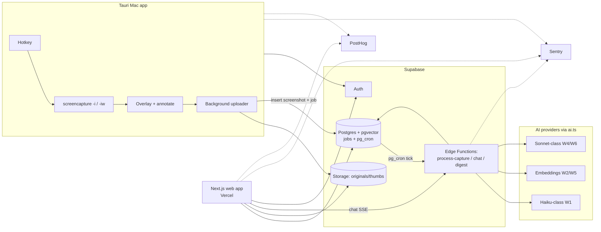

# 11 — Architecture (MVP)

> Capso (working name — unconfirmed). System shape, decision tables with tradeoffs, and the two integration points most likely to burn schedule.
> Siblings: `09_AI_SYSTEM_AND_MODEL_ROUTING.md` (model routing), `10_DATA_MODEL.md` (schema), `14_BACKEND_AND_STORAGE.md` (jobs/buckets detail).

## Assumptions

- Solo TS-skilled builder (Elvin) + agent build loops; ~2–4 week MVP window. Shipping speed beats elegance wherever UX isn't harmed.
- Supabase is the owner's existing stack (HeyOmmi) — operational familiarity is a real asset, counted in the decisions below.
- Web app and Edge Functions deploy from one monorepo; Mac app in the same repo under `~/…/capso/apps/mac`.

## Out of scope

- Scrolling capture, screen recording, sensitive-exclude (post-MVP; capture-engine decision keeps the door open).
- Billing infrastructure (documented in `09` §5; not built).
- Windows/Linux clients; mobile.

## 1. Components

| Component | Role | Stack |
|-----------|------|-------|
| Tauri Mac app | Menu-bar capture bar: hotkeys, region/window capture via `screencapture -i` / `-iw`, clipboard copy, basic annotation (arrow/box/text/blur), floating post-capture overlay with AI suggestion, background upload | Tauri 2, React + TS |
| Next.js web app | Library, thread views, chat, search, Inbox triage, digest surface | Next.js 15 on Vercel |
| Supabase | Postgres (+pgvector) = source of truth; Storage = images; Auth = identity; Edge Functions = workers + chat endpoint; jobs table + pg_cron = async pipeline | Supabase cloud |
| AI providers | Haiku-class multimodal (W1), embeddings (W2/W5), Sonnet/Fable-class (W4/W6) — all behind `ai.ts` (09 §8) | HTTPS APIs |
| PostHog | Product analytics: capture funnel, suggestion accuracy, revisit rate, gate counters | Cloud |
| Sentry | Errors: Mac app (Rust + JS), web, Edge Functions | Cloud |

## 2. System diagram



## 3. Capture → searchable sequence

```mermaid
sequenceDiagram
    participant U as User
    participant M as Mac app
    participant ST as Storage
    participant DB as Postgres
    participant W as Edge Fn worker
    participant AI as Haiku-class + Embeddings

    U->>M: Hotkey → region/window select
    M->>M: screencapture writes PNG; overlay shows thumbnail
    par background
      M->>ST: upload original (+ generate & upload WebP thumb)
      M->>DB: INSERT screenshots(status=pending) + jobs(process_capture)
    end
    DB-->>W: pg_cron tick (~15s) dequeues job
    W->>DB: few-shot corrections + candidate threads (W7/W3)
    W->>AI: ONE multimodal call → CaptureAnalysis JSON, then embed
    AI-->>W: {ocr_text, summary, type, intent, project_suggestion, confidence, why_saved}
    W->>DB: update screenshots (ocr/summary/tsv/embedding, status=processed), insert classification_suggestion; auto-assign if conf ≥ 0.8
    M->>DB: overlay polls/Realtime-subscribes suggestion (~3–5s target)
    M-->>U: "Looks like → Thread X" confirm / ignore
    U->>M: confirm → outcome=confirmed (or correction row if overridden)
```

Latency budget for the 3–5s inline suggestion: upload ≤1.5s (thumb-sized first if needed) + queue wait ≤2s + W1 ≤2s. If pg_cron's tick granularity threatens the budget, the uploader may also fire the worker Edge Function directly after insert ("kick"), with pg_cron as the sweeper for missed kicks — requirement: pipeline must not depend on the kick for correctness.

## 4. Decision tables (requirements — chosen options locked unless noted)

### 4.1 Mac shell

| Criterion | **Tauri 2 (chosen)** | Electron | Native Swift |
|-----------|----------------------|----------|--------------|
| Shipping speed (TS-skilled solo dev) | High — React/TS UI, small API surface | High — most docs/examples | Low — new language + AppKit learning curve |
| Memory footprint (always-on menu bar) | ~50–90 MB | ~200–400 MB (Chromium) | Best (~30 MB) |
| Native capture access | Shells out to `screencapture`; Rust side for global hotkeys/overlay windows | Same shell-out; mature tray/hotkey libs | Full ScreenCaptureKit power |
| Risk | Overlay-window + permission edge cases less trodden | Bloat for a resident app | Schedule-fatal for 2–4 wks |

**Fallback rule (requirement):** if Tauri friction (overlay windows, hotkeys, permissions) exceeds **~2 days** of the schedule, switch to Electron without renegotiating scope. Native Swift is not an MVP option.

### 4.2 Capture engine

| Criterion | **`screencapture` CLI (chosen for MVP)** | ScreenCaptureKit custom |
|-----------|------------------------------------------|--------------------------|
| Build cost | Near zero — `-i` (region) / `-iw` (window) give Apple's own picker UI free | Days–weeks of Swift/Rust bridging |
| UX | Apple-standard, familiar | Fully custom picker, on-brand |
| Capability ceiling | No scrolling capture, no recording | Needed for scrolling capture, recording, custom picker (post-MVP roadmap) |
| Permissions | Screen-Recording permission attributed to our app binary (see risk §6) | Same permission, more control over prompting |

Revisit trigger: when scrolling capture becomes the top roadmap item, budget a ScreenCaptureKit spike then.

### 4.3 Backend

| Criterion | **Supabase (chosen)** | Custom Node + Postgres | Convex |
|-----------|------------------------|------------------------|--------|
| Speed to MVP | Auth, Storage, RLS, pgvector, cron out of the box; owner already operates it (HeyOmmi) | Everything hand-rolled; weeks | Fast, great DX |
| Fit | pgvector + tsvector + jobs in one DB = whole pipeline in SQL | Max flexibility | No native pgvector/Postgres semantics; vector story different; new mental model |
| Lock-in / exit | It's Postgres — dump and leave | None | Higher |
| SaaS-ready | RLS multi-tenant from day one | DIY | Yes |

### 4.4 Async pipeline

| Criterion | **jobs table + pg_cron → Edge Fn worker (chosen)** | External queue (SQS/Upstash QStash/Inngest) |
|-----------|-----------------------------------------------------|---------------------------------------------|
| Moving parts | Zero new services; job state visible with plain SQL | +1 vendor, +1 dashboard, +webhooks |
| Throughput need | One user, ≤ ~50 captures/day — trivial | Overkill |
| Delivery semantics | At-least-once via status+attempts columns; idempotent workers required (14 §3) | Better built-in retries/DLQ |
| Exit path | If multi-user scale arrives, swap dequeue loop for QStash push; job rows keep same shape | — |

## 5. Auth (requirement)

Supabase Auth everywhere. Web: standard magic-link session. **Mac app: magic-link driven device flow** — app opens the browser to a `/link-device` page; after web login, the page displays a one-time code the user pastes into the app (or deep-links back via `capso://` URL scheme), and the app stores the refresh token in the macOS Keychain. Choose whichever of paste-code vs deep-link is less Tauri friction; both acceptable. Tokens never in plaintext config files.

## 6. Two riskiest integration points (requirement — spike these first)

1. **Tauri ↔ `screencapture` permission flow.** Screen-Recording (and possibly Accessibility for hotkeys/window info) permission must be granted to the Tauri binary; sandboxing, dev-vs-bundled binaries, and unsigned dev builds all change how macOS attributes the permission, and a denied state fails silently (black/empty captures). **Mitigation:** day-1 spike — bundled, signed dev build; explicit permission-check + onboarding screen that detects denial and deep-links to System Settings. This spike is also the trigger for the 4.1 Electron fallback rule.
2. **Edge Function timeout limits on vision calls.** Supabase Edge Functions have bounded wall-clock/CPU time; a slow W1 vision call plus image fetch can exceed it, and chat (W4) streams long responses. **Mitigation:** workers process **one job per invocation** (cron fan-out, no batching in a single invocation); pass the image by Storage signed URL (provider fetches it — no base64 megabytes through the function); W4 chat uses streaming SSE from the Edge Function, and if streaming limits bite, chat moves to a Next.js route handler on Vercel (same `ai.ts` module, so the move is cheap). Verify current limits at build time.

## 7. Ideas (explicitly not requirements)

- Supabase Realtime channel instead of polling for overlay suggestion delivery.
- Menu-bar quick-search (⌘K over captures) once retrieval quality is proven in web.
- Local write-ahead queue in the Mac app so captures survive offline periods (upload when back online).
