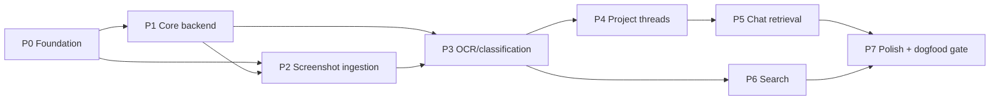

# 19 — Build Sequence

Phased MVP build plan for Capso, sized to 2–4 weeks of agent build loops. Each phase is a gate: do not start a phase until its entry criteria hold. Agents executing this plan MUST follow `20_AGENT_LOOP_INSTRUCTIONS.md` and verify against `21_ACCEPTANCE_CRITERIA.md` / `22_TEST_PLAN.md`.

## Assumptions

- Supabase project and Vercel project exist or are created in P0 (owner approves any external signup per `20_AGENT_LOOP_INSTRUCTIONS.md` stop rules).
- Schema source of truth is `10_DATA_MODEL.md`; scope source of truth is `04_MVP_SCOPE.md`.
- One Haiku-class vision call per capture; Sonnet-class only for chat/digest (locked in MASTER_PLAN.md).
- Tauri 2 is the Mac shell. Electron fallback triggers only if Tauri friction exceeds 2 working days in P2 — owner decision, not agent decision.
- "Loop" = one agent build loop per `20_AGENT_LOOP_INSTRUCTIONS.md` (single verifiable outcome).

## Out of scope (entire MVP)

Billing/Stripe (P8-future), scrolling capture, screen recording, link/PDF ingestion (schema-ready only), fine-tuning, team/sharing features, Windows/Linux.

## Dependency graph

Risk note: **P2 is the riskiest phase** (macOS Screen Recording permission, `screencapture` behavior, Tauri global hotkeys, overlay window layering). Start P2 as soon as P1 schema lands — do not defer it behind P3/P4 polish. If Tauri friction >2 days, STOP and surface Electron fallback decision to owner.

**Owner-approved sequencing exception (D15, 2026-08-08):** P1 schema, owner-only RLS,
private Storage buckets, and the web remote-store path are live. P2 native local capture
primitives may therefore proceed now to retire the highest platform risk, even though P0
production Mac auth/CI/telemetry and P1 jobs/worker work remain incomplete. A strict native
PKCE/ingest contract is compiled (`c3278ba`) but has no session or network adapter. This
exception does not permit claiming AC-CAP-03, AI-01, P2 done, or dogfood readiness until
authenticated native ingest and browser-independent processing are complete.

---

## P0 — Foundation

**Objective:** Monorepo scaffold with all three surfaces wired: Tauri menu-bar app boots, Next.js app deploys, Supabase auth works end-to-end, CI runs typecheck on every push.

**Entry criteria:** Pack docs approved; Supabase + Vercel accounts confirmed by owner.

**Tasks:**
- [x] Monorepo scaffold (pnpm workspaces): `apps/mac` (Tauri 2 + React + TS), `apps/web` (Next.js 15 App Router), `packages/shared` (types, zod schemas) <!-- loop 01; Next 16.2.12 shipped by create-next-app, see BUILD_LOG deviation -->
- [ ] Supabase project created; `.env.local` templates (`.env.example`) for both apps; secrets never committed <!-- partial: .env.example done (loop 01); project creation BLOCKED on owner, STOP rules 3+4 -->
- [ ] Supabase Auth wired: email magic-link sign-in works on web; Mac app stores session and can call an authenticated endpoint <!-- partial: c3278ba proves a strict native-origin PKCE callback and shared authenticated-ingest contract; the native client now compiles a real JWT-authenticated Storage/RPC adapter, but deep-link registration, Supabase exchange, Keychain session, anonymous-library linking, production apply, and runtime instantiation remain -->
- [x] Tauri menu-bar app boots with tray icon + empty popover window <!-- loop 02 -->

- [x] Vercel deploy of `apps/web` <!-- production deployed in BUILD_LOG loop 20; real app, not empty shell -->
- [ ] CI: GitHub Actions running `pnpm typecheck`, `pnpm lint`, `pnpm test` on push
- [ ] Sentry + PostHog SDK initialized in both apps (keys via env, no events beyond init yet)

**Done criteria:** Fresh clone → `pnpm install` → both apps run locally; sign in on web and in Mac app with the same account; CI green on main.

**Primary docs:** MASTER_PLAN.md, 04_MVP_SCOPE.md, specs/permission_model.md.
**Do NOT build:** any capture, any schema tables beyond auth defaults, any UI beyond sign-in shell.
**Estimated loops:** 3–4.

---

## P1 — Core backend

**Objective:** Full schema live, storage buckets configured, jobs pipeline skeleton processing no-op jobs.

**Entry criteria:** P0 done; `10_DATA_MODEL.md` approved.

**Tasks:**
- [ ] Migration implementing full schema from `10_DATA_MODEL.md` (screenshots, projects, threads, messages, jobs, corrections, embeddings via pgvector; links/PDF columns schema-ready but unused)
- [x] RLS policies: owner-only access on every table (single-user MVP, but enforce anyway) <!-- migration 0001; applied per BUILD_LOG loop 12 -->
- [x] Storage buckets: `originals`, `thumbs`, private, RLS-scoped <!-- migration 0002; remote store shipped -->
- [ ] Jobs table + `pg_cron` tick + Edge Function worker skeleton: claim job (`FOR UPDATE SKIP LOCKED`), execute, mark done/failed, retry with backoff, `attempts` cap → terminal status <!-- partial: Loop 47 adds the unapplied jobs migration plus a locally verified one-job MiniMax worker with exact leases, bounded retries/context, service-role-only RPCs, and 18 Deno tests; job production, Vault/Cron, production apply/deploy, and live integration proof remain -->
- [ ] Generated TS types from schema into `packages/shared`
- [ ] Seed script for local dev (1 project, 3 fake screenshot rows)

**Done criteria:** Migration applies clean on fresh branch DB; inserting a no-op job row results in `status='done'` within one cron tick; RLS verified (second test user sees zero rows); typecheck passes with generated types.

**Primary docs:** 10_DATA_MODEL.md, specs/api_contracts.md, 22_TEST_PLAN.md (integration section).
**Do NOT build:** any AI calls, any capture UI, any web pages.
**Estimated loops:** 3–4.

---

## P2 — Screenshot ingestion (RISKIEST — start early)

**Objective:** Hotkey → region/window capture → overlay → queued upload → Storage object + `screenshots` row. Web drag-drop ingest as second path.

**Entry criteria:** P1 schema + buckets live; Mac test machine with permissions grantable.

**Current phase:** active under D15. Schema/buckets satisfy the local capture entry gate;
unfinished auth/worker work remains a downstream blocker explicitly tracked by the hourly
loop.

**Tasks:**
- [ ] Global hotkey (default ⌘⇧5-alternative) triggering region, window, and fullscreen `screencapture` modes; result copied to clipboard <!-- fullscreen added by D15; partial: command seam 01c05d1, conflict-safe defaults/tray fallbacks 056801e, persisted rollback-safe editable bindings d4d2bff, and persist-first exact-byte AppKit clipboard 3496c82 are Checker-approved; physical shortcut/picker/general-pasteboard QA remains -->
- [x] Screen Recording permission detection + guidance UI; Accessibility is neither needed nor requested (`b507eec`; native grant/revoke QA remains) (specs/permission_model.md)
- [ ] Post-capture floating overlay window (always-on-top, non-activating): thumbnail, Confirm / Ignore / Ask AI placeholders, auto-dismiss timer <!-- partial: hidden-until-decode display-correct overlay 91e6643; generation-safe Copy, atomic Save As, Close, and hover/action-paused auto-dismiss 8923e90; exact restore 8bd0888; copy-only native drag-out db0ab1e; queue-timestamped five-item thumbnail history plus Open Library e0b1020; and privacy-safe latest-20 process-completion-to-native-show speed evidence ec43534 are Checker-approved; native focus/relaunch/multi-display/interaction and physical 20-capture latency QA plus AI placeholders remain -->
- [ ] Local upload queue: persist to disk (SQLite or JSON queue), retry on failure, survives app restart, drains on reconnect (offline support — AC-OFF-01) <!-- partial: a5c5e80 syncs capture pixels before atomic JSON handoff and proves restart FIFO/orphan recovery, exact 5s/30s/2m retry, four-attempt poison isolation, idempotency, corrupt-store preservation, and zero capture deletion; b3b9641 adds the production-compiled single-flight coordinator; c3278ba adds the strict authenticated contract; the real bounded Storage/RPC transport now preserves no-attempt credential holds, retryable failures, terminal poison isolation, and exact acknowledgements. Auth session instantiation, real connectivity/retry wake sources, and the offline drill remain -->
- [ ] Upload path: Storage put (original + generated thumbnail) → insert `screenshots` row → enqueue `process_screenshot` job <!-- partial: the macOS client now has a bounded JWT-authenticated original-PNG Storage/RPC transport and the unapplied RPC atomically inserts the owner-derived screenshot + process job with exact retry acknowledgement; thumbnail generation, auth/runtime wiring, production apply, and live integration remain -->
- [ ] Web: drag-drop / paste ingest on `apps/web` hitting the same upload path
- [ ] Library grid on web listing captured screenshots (newest first, thumbnail + timestamp)

**Done criteria:** AC-CAP-01..04 and AC-OFF-01 pass (`21_ACCEPTANCE_CRITERIA.md`); capture on Mac appears in web library <10s on normal network; kill network, capture 3×, restore network → all 3 upload.

**Primary docs:** specs/user_flows.md, specs/edge_cases.md, specs/permission_model.md, 21_ACCEPTANCE_CRITERIA.md (P2 section).
**Do NOT build:** annotation tools, AI suggestion chip (placeholder only), scrolling capture, multi-display polish beyond "works".
**Estimated loops:** 5–7 (budget for macOS friction; escalate per stop rules if Tauri friction >2 days).

---

## P3 — OCR / classification

**Objective:** Every uploaded screenshot gets one Haiku-class vision call producing structured JSON + one embedding; results visible on screenshot detail view.

**Entry criteria:** P2 upload path produces `process_screenshot` jobs reliably.

**Tasks:**
- [ ] Edge Function worker: fetch image → vision call → validate against zod schema `{ocr_text, summary, type, intent, project_suggestion, confidence, why_saved}` → write to `screenshots` row <!-- partial: Loop 47 implements and locally verifies the worker core, exact owner/path/context boundaries, one repair retry, confidence routing, atomic settlement, and MiniMax adapter; it is not deployed or fed by production jobs -->
- [ ] Embedding generation (summary + ocr_text) → pgvector column
- [x] JSON schema validation with one repair-retry on invalid output; invalid twice → bounded job retry/terminal handling <!-- Loop 47 local worker contract; hosted integration remains under the worker item above -->
- [ ] Idempotency: reprocessing same screenshot overwrites, never duplicates
- [ ] Confidence routing fields persisted (≥0.8 auto / 0.5–0.8 suggest / <0.5 inbox) — routing consumed in P4
- [ ] Screenshot detail view (web): image, OCR text, summary, type/intent chips, why_saved
- [ ] Golden-set eval script per `22_TEST_PLAN.md` (T-EVAL group)

**Done criteria:** AC-OCR-01 passes (known text findable within 30s — keyword path may land fully in P6; interim check: `ocr_text` populated correctly); eval script ≥80% on golden set; poison-job test passes (T-REL group).

**Primary docs:** prompts/FABLE5_MVP_BUILD_PROMPT.md, specs/api_contracts.md, specs/event_schema.md, 22_TEST_PLAN.md.
**Do NOT build:** chat, few-shot corrections, weekly digest, Sonnet-class calls.
**Estimated loops:** 4–5.

---

## P4 — Project threads

**Objective:** AI suggestion surfaced on the overlay chip; one-click confirm; Inbox triage; per-project thread views.

**Entry criteria:** P3 produces `project_suggestion` + `confidence` reliably.

**Tasks:**
- [ ] Projects CRUD (web + minimal Mac popover list)
- [ ] Overlay AI chip: poll/subscribe for processing result, show suggested project ≤5s p50; Confirm (one click) / Ignore (→ Inbox) / dismiss
- [ ] Confidence routing live: ≥0.8 auto-assign (overlay shows assignment, one-click undo), 0.5–0.8 suggest, <0.5 Inbox
- [ ] Inbox view (web): unassigned screenshots, assign-to-project, bulk assign
- [ ] Thread view per project: chronological screenshots + future chat messages
- [ ] Corrections capture: reassignment writes a `corrections` row (consumed by few-shot in P5-adjacent loop)
- [ ] Few-shot injection: last N relevant corrections included in classification prompt context (AC-COR-01)

**Done criteria:** AC-SUG-01..03 and AC-COR-01 pass; overlay chip p50 <5s measured over 20 captures; ignored capture lands in Inbox.

**Primary docs:** specs/user_flows.md, 21_ACCEPTANCE_CRITERIA.md (P4 section), 10_DATA_MODEL.md (corrections).
**Do NOT build:** chat responses, digest, project sharing, drag-reorder polish.
**Estimated loops:** 4–5.

---

## P5 — Chat retrieval

**Objective:** Sonnet-class chat inside a project thread, with context assembly over that thread's screenshots and a `search_memory` tool.

**Entry criteria:** P4 threads populated with processed screenshots.

**Tasks:**
- [ ] Chat API route (Edge Function or Next.js route): streaming, thread-scoped
- [ ] Context assembly: thread screenshots (summaries + OCR excerpts) under a token budget, newest-first with pinned relevance (unit-tested per T-UNIT-03)
- [ ] `search_memory` tool: model-callable hybrid search across the user's screenshots (semantic + keyword + date filter)
- [ ] Answer citations: response names which screenshots were used (IDs → rendered as thumbnails/links)
- [ ] Chat UI in thread view (web) + "Ask AI" on overlay deep-links into thread chat
- [ ] Message persistence to `messages` table

**Done criteria:** AC-CHAT-01..02 pass; first token <3s p50; citations render and resolve to real screenshots.

**Primary docs:** specs/api_contracts.md, 21_ACCEPTANCE_CRITERIA.md (P5), 22_TEST_PLAN.md (context assembly, search quality).
**Do NOT build:** weekly digest, cross-user anything, chat outside threads (global chat is post-MVP).
**Estimated loops:** 4–5.

---

## P6 — Search

**Objective:** Global hybrid search UI: natural language + keyword + filters (project, type, date).

**Entry criteria:** P3 embeddings + OCR text populated; can run parallel to P5 after P3.

**Tasks:**
- [ ] Search API: hybrid ranking (vector similarity + Postgres FTS on ocr_text/summary + recency), single ranked list (ranking formula unit-tested per T-UNIT-02)
- [ ] Date parsing for queries like "pricing page saved in March" (date extraction → filter + semantic remainder)
- [ ] Search UI: omnibox on web, results grid with match highlighting, filters (project, type, date range)
- [ ] Golden query set eval per T-SRCH group
- [ ] Deletion flow: hard delete removes original, thumb, rows, embedding (AC-DEL-01) — lives here because search must not return ghosts

**Done criteria:** AC-OCR-01, AC-RET-01..02, AC-DEL-01 pass; search p50 <1.5s; golden query set hit-rate meets `22_TEST_PLAN.md` threshold.

**Primary docs:** specs/api_contracts.md, 21_ACCEPTANCE_CRITERIA.md (P6), 22_TEST_PLAN.md (T-SRCH).
**Do NOT build:** saved searches, search analytics dashboards, cross-type search (links/PDFs).
**Estimated loops:** 3–4.

---

## P7 — Polish + dogfood gate

**Objective:** Daily-drivable app: annotation, onboarding, empty states, telemetry, signed dmg. Ends with the dogfood gate: Elvin replaces CleanShot X for 5 consecutive workdays.

**Entry criteria:** P2–P6 done criteria all green.

**Tasks:**
- [ ] Annotation editor on overlay/detail: arrow, box, text, blur; flattened annotated PNG uploaded as the stored version (AC-ANN-01) <!-- partial: `42fcfbf` adds the native four-tool editor and durable flatten path; `4651859` proves exact golden redaction pixels through local save/original protection, clipboard, queue restart recovery, and drain consumption. Physical all-tool QA and a downloaded production object comparison remain. -->
- [ ] Onboarding: permission walkthrough, hotkey setup, first-capture nudge
- [ ] Empty states: library, inbox, thread, search-no-results
- [ ] PostHog events per specs/event_schema.md; Sentry release tagging both apps
- [ ] Dark mode pass; multi-display capture QA; manual UX checklist from `22_TEST_PLAN.md`
- [ ] Signed + notarized dmg build (Developer ID — owner provides cert; STOP-rule item)
- [ ] BUILD_LOG.md retro + MASTER_PLAN.md status update

**Done criteria:** Full `21_ACCEPTANCE_CRITERIA.md` pass; manual QA checklist signed off; dmg installs clean on a fresh Mac; dogfood gate started.

**Primary docs:** 21_ACCEPTANCE_CRITERIA.md (all), 22_TEST_PLAN.md (manual QA), specs/event_schema.md.
**Do NOT build:** billing, sharing, scrolling capture, auto-update infra beyond a stub check.
**Estimated loops:** 4–6.

---

## P8-future — Billing (PARKED)

Freemium tiers are documented in the pricing doc; **no billing code in MVP**. No Stripe SDK, no paywall UI, no entitlement checks. Revisit only after the dogfood gate passes and outside users are invited.

## Loop budget summary

| Phase | Loops | Cumulative |
|---|---|---|
| P0 | 3–4 | 4 |
| P1 | 3–4 | 8 |
| P2 | 5–7 | 15 |
| P3 | 4–5 | 20 |
| P4 | 4–5 | 25 |
| P5 | 4–5 | 30 |
| P6 | 3–4 | 34 |
| P7 | 4–6 | 40 |

At ~2–3 loops/day this is ~3 weeks nominal, 4 weeks with P2 friction. If cumulative slip exceeds 1 week, cut from P7 polish (never from P2/P3 reliability) and surface the cut list to the owner.
