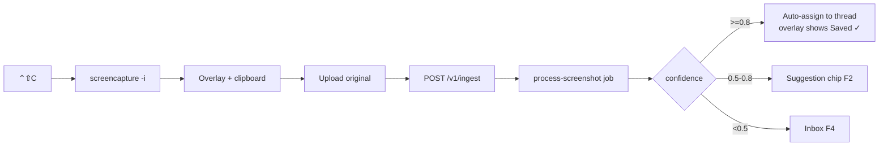
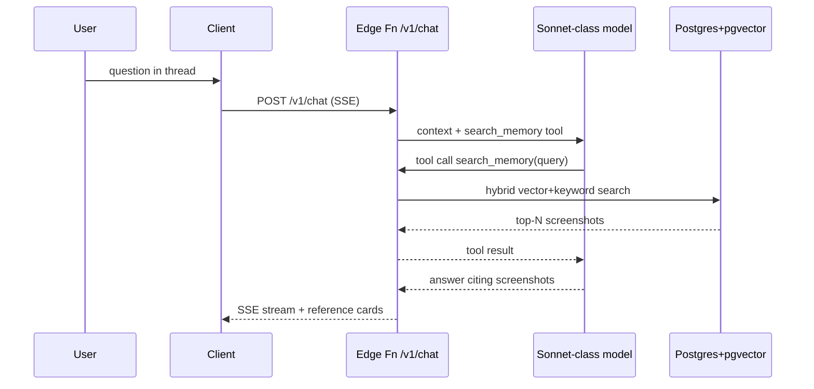

# Capso — User Flows (v1)

Step format: **N. actor → action → system response → state change.**
Actors: `User`, `MacApp` (Tauri menu-bar app), `Web` (Next.js app), `Server` (Supabase Edge Functions + jobs), `AI` (vision/chat model calls).

Cross-refs: capture behavior ../05_FEATURE_SPEC_CAPTURE.md, AI pipeline ../06_FEATURE_SPEC_AI_MEMORY.md and ../09_AI_SYSTEM_AND_MODEL_ROUTING.md, threads ../07_FEATURE_SPEC_PROJECT_THREADS.md, tables ../10_DATA_MODEL.md, events event_schema.md, failure branches edge_cases.md.

## Assumptions

- User is signed in on both Mac app and web (Supabase Auth session). First-run is F9.
- Every capture fires `capture_started` / `capture_completed` and upload fires `upload_succeeded` per event_schema.md; steps below only call out non-obvious events.
- Confidence routing (locked): ≥0.8 auto-assign, 0.5–0.8 suggest, <0.5 Inbox.
- Overlay auto-dismisses ~8s after the suggestion chip resolves; dismissal without action = ignore (F4).

## Out of scope

- Links/files capture kinds, billing, sharing, mobile. Weekly digest generation flow (server cron; see ../06_FEATURE_SPEC_AI_MEMORY.md) — only its events are defined in event_schema.md.

---

## F1 — Hotkey region capture → auto-save with high-confidence auto-assign

1. User → presses ⌃⇧C → MacApp fires `capture_started`, invokes `screencapture -i` → macOS crosshair picker active.
2. User → drags region, releases → macOS writes PNG to temp path; MacApp copies image to clipboard → local capture record created (status `captured`).
3. MacApp → shows floating thumbnail overlay (bottom-right) with "Analyzing…" chip → begins background upload to Storage `originals/{user_id}/{uuid}.png` → `capture_completed` fired.
4. MacApp → on upload success calls `POST /v1/ingest` (see api_contracts.md) → Server inserts `screenshots` row + `jobs` row (`process-screenshot`, pending) → `upload_succeeded`; screenshot status `processing`.
5. Server → worker runs vision call → AI returns `{ocr_text, summary, type, intent, project_suggestion, confidence: 0.91, why_saved}` + embedding → row updated, job `done` → `ai_processing_completed`.
6. Server → confidence 0.91 ≥ 0.8 → auto-assigns screenshot to suggested project thread → `screenshot.project_id` set, `assignment_source = auto`.
7. MacApp → overlay chip updates (via Realtime subscription) to "Saved to ▸ HeyOmmi launch ✓ (edit)" → `ai_suggestion_shown` with `mode: auto_assign`.
8. User → does nothing → overlay fades after ~8s → assignment stands; no further events. (If User clicks "edit", branch to F2 step 6.)

## F2 — Capture → medium-confidence suggestion → user adjusts project

1–5. Same as F1 steps 1–5, but AI returns `confidence: 0.64`.
6. Server → 0.5 ≤ 0.64 < 0.8 → no auto-assign; suggestion stored on screenshot → status `awaiting_confirmation`.
7. MacApp → overlay chip shows "Suggest: ▸ Competitor research  [✓] [change] [ignore]" → `ai_suggestion_shown` with `mode: suggest`.
8. User → clicks "change" → MacApp shows inline project picker (recent threads + search + "New thread…").
9. User → picks thread "Pricing teardown" → MacApp calls `POST /v1/suggestion/respond` `{action: "correct", chosen_project_id}` → Server sets `project_id`, `assignment_source = user_corrected`, writes `user_corrections` row (used as few-shot context per ../09_AI_SYSTEM_AND_MODEL_ROUTING.md) → `ai_suggestion_corrected`.
10. MacApp → chip confirms "Saved to ▸ Pricing teardown ✓" → overlay fades → done. (Accepting as-is instead: `action: "accept"` → `ai_suggestion_accepted`.)

## F3 — Capture → "Ask AI" → thread chat about the fresh screenshot

1–7. Same as F2 through the suggestion chip (works from any confidence band; overlay always has an "Ask AI" button).
8. User → clicks "Ask AI" on overlay → MacApp opens chat panel scoped to the suggested/assigned thread (or Inbox scratch thread if unassigned) with the screenshot attached as context.
9. User → types "邊間 competitor 出咗呢個 pricing？" and sends → MacApp calls `POST /v1/chat` `{thread_id, message, screenshot_ids: [id]}` → `chat_message_sent`, `chat_screenshot_referenced`.
10. Server → assembles context per ../07_FEATURE_SPEC_PROJECT_THREADS.md (thread history + attached screenshot's OCR/summary) → streams Sonnet-class response via SSE. If the screenshot's job is still `processing`, Server waits up to ~5s then answers with a "still processing" note (see edge_cases.md).
11. MacApp → renders streamed answer with the screenshot pinned in the transcript → chat messages persisted to `chat_messages` → user may continue the thread.

## F4 — Capture ignored → Inbox → later triage in web app

1–7. Same as F2 through the suggestion chip.
8. User → clicks "ignore" (or lets overlay time out) → MacApp calls `POST /v1/suggestion/respond` `{action: "ignore"}` → Server leaves `project_id` null, status `inbox` → `ai_suggestion_ignored`.
9. (Later) User → opens Web → Inbox view lists unassigned screenshots newest-first with thumbnail, summary, intent chip, and the original suggestion.
10. User → selects one → clicks "Assign ▸" and picks a thread (or "New thread", firing `thread_created`) → Web writes `project_id` via Supabase SDK, `assignment_source = inbox_triage`; if the pick differs from the stored suggestion a `user_corrections` row is written → `ai_suggestion_corrected` (or `_accepted` if it matches).
11. Web → item leaves Inbox; thread's screenshot grid updates → done. Bulk-select assign follows the same contract per item.

## F5 — Web natural-language search → open result → revisit logged

1. User → types "the dark pricing page with the countdown timer" in Web search bar, hits Enter → Web calls `GET /v1/search?q=…` → `search_performed` (query hashed/length-only per event_schema.md PII rule).
2. Server → embeds query, runs hybrid pgvector + keyword search over `screenshots` → returns ranked results with `match_reasons` (see api_contracts.md).
3. Web → renders result grid; each card shows thumbnail, summary snippet, thread name, match reason.
4. User → clicks a result → `search_result_clicked` with rank → Web opens screenshot detail view (full image via short-lived signed URL, OCR text, metadata, thread link).
5. Server → detail open writes a `revisits` row → `screenshot_revisited` (the core "memory pays off" metric in ../17_METRICS_AND_ANALYTICS.md).
6. User → optionally jumps to the containing thread or asks AI about it (→ F6 pattern) → done.

## F6 — In-thread chat retrieving older screenshots (search_memory tool)

1. User → in thread "HeyOmmi launch" chat (Web or MacApp) asks "what onboarding patterns did I save last month?" → client calls `POST /v1/chat` → `chat_message_sent`.
2. Server → builds context per ../07_FEATURE_SPEC_PROJECT_THREADS.md and calls Sonnet-class model with the `search_memory` tool exposed (api_contracts.md defines its schema).
3. AI → emits `search_memory({query: "onboarding pattern", project_id, date_range})` tool call → Server executes the same retrieval as /v1/search scoped to the thread (with an all-projects fallback flagged in the reply).
4. Server → returns top-N hits (id, summary, OCR excerpt, captured_at) to the model as tool results → each surfaced screenshot fires `chat_screenshot_referenced` (server-side).
5. AI → composes answer citing specific screenshots → Server streams SSE with inline reference tokens; zero hits → model must say nothing was found (edge_cases.md), never invent.
6. Client → renders answer with tappable screenshot cards → User clicks one → detail view opens; `screenshot_revisited` logged as in F5.
7. Server → persists both messages with `referenced_screenshot_ids` → state: thread transcript grown, revisits recorded.

## F7 — Annotation flow (capture → annotate → save)

1–2. Same as F1 steps 1–2 (region or window capture).
3. User → clicks the pencil icon on the overlay thumbnail before it fades → MacApp opens the lightweight annotation window with the capture.
4. User → applies arrow/box/text/blur (blur is destructive on export — used to redact secrets; see permission_model.md threat notes) → edits held locally.
5. User → clicks "Save" → MacApp flattens annotations into the PNG, re-copies to clipboard → `annotation_used` with `tools_used` array; upload/ingest proceeds as F1 steps 3–4 with the annotated image as the original.
6. Server/AI → pipeline identical to F1 steps 5+ (OCR runs on the annotated image; blurred regions are intentionally unreadable) → suggestion/auto-assign as usual. Cancel in the editor → uploads the unannotated original instead.

## F8 — Drag image into web app

1. User → drags an image file onto the Web app (any view; thread view pre-targets that thread) → Web shows drop target, validates type/size (see edge_cases.md).
2. Web → uploads to `originals/` via Supabase Storage SDK, computes `content_hash` client-side → `capture_started` + `capture_completed` with `source: web_upload` (`drag` on the Mac app's drop zone).
3. Web → calls `POST /v1/ingest` with `source: "web_upload"` → same job pipeline as F1 steps 4–6 → `upload_succeeded`.
4. Web → row appears immediately with "Processing…" badge; on `ai_processing_completed` the summary/intent fill in via Realtime.
5. System → confidence routing as F1/F2/F4, except suggestions land as an inline banner on the screenshot card (no Mac overlay); dropped-into-a-thread images skip suggestion and assign directly (`assignment_source = manual`).

## F9 — Onboarding first-run (sign-in, permissions, first capture)

1. User → launches Capso.app first time → MacApp menu-bar icon appears, welcome window opens → state: signed-out.
2. User → clicks "Sign in" → MacApp opens browser to Web auth (Supabase Auth, magic link/OAuth) → deep-links session back to the app → session stored in keychain.
3. MacApp → requests Screen Recording permission with an explainer screen (why + degraded mode; see permission_model.md) → macOS System Settings prompt → User grants and relaunches app if macOS requires it.
4. MacApp → registers global hotkeys ⌃⇧C/⌃⇧W (conflict handling in edge_cases.md), offers optional Login Item + Notifications toggles → defaults saved.
5. MacApp → shows "Try it: press ⌃⇧C and grab anything" coach mark → User performs first capture → full F1 pipeline runs.
6. MacApp → on first `ai_suggestion_shown`, coach mark explains confirm/adjust/ignore → User acts → `onboarding_completed` fired with `duration_ms` → state: onboarded flag set in `user_settings`.

## F10 — Delete screenshot

1. User → on Web detail view (or Mac history list) clicks "Delete" → client shows confirm dialog: "Deletes image, thumbnail, OCR text, embeddings and chat references. Cannot be undone."
2. User → confirms → client calls Supabase RPC `delete_screenshot(screenshot_id)` (single transaction; contract in api_contracts.md).
3. Server → hard-deletes `screenshots` row, embedding, revisits, suggestion/correction rows; nulls `referenced_screenshot_ids` entries in chat messages (messages themselves survive with a "deleted screenshot" placeholder); removes Storage objects in `originals/` and `thumbs/` → `screenshot_deleted` fired server-side.
4. Client → card removed from all views; open chat transcripts render placeholder → state: no recoverable trace (privacy guarantee in permission_model.md).
